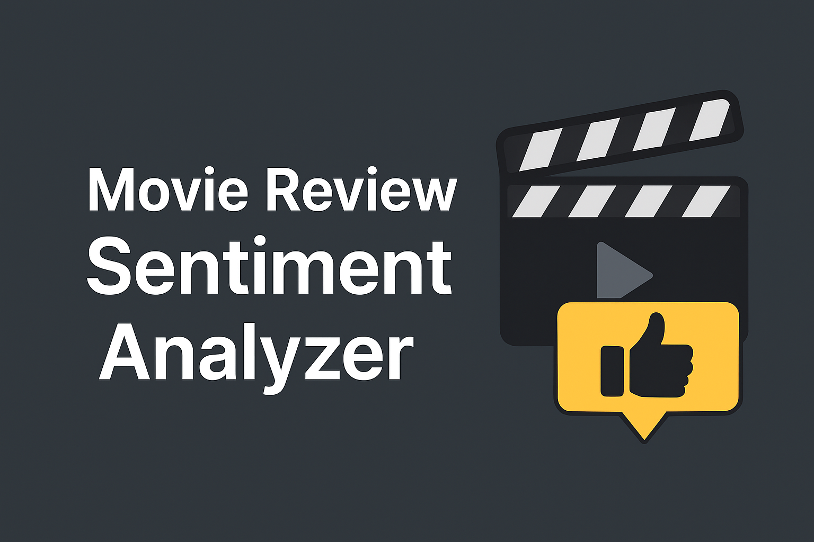
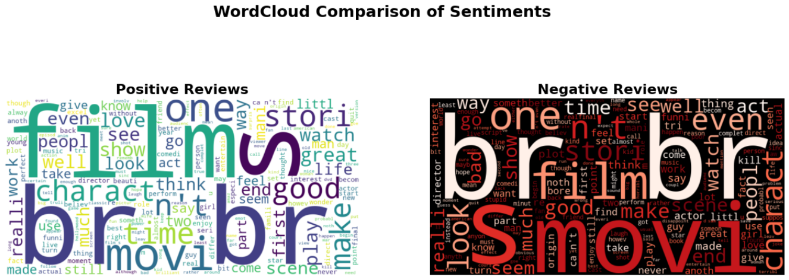

# 🎬 Movie Review Sentiment Analyzer  

  

---

## 📖 Table of Contents  
1. [Overview](#overview)  
2. [Objectives](#objectives)  
3. [Workflow](#workflow)  
   - [1. Data Loading](#1-data-loading)  
   - [2. Data Preprocessing](#2-data-preprocessing)  
   - [3. Exploratory Data Analysis (EDA)](#3-exploratory-data-analysis-eda)  
   - [4. Feature Engineering](#4-feature-engineering)  
   - [5. Model Training & Evaluation](#5-model-training--evaluation)  
   - [6. Error Analysis](#6-error-analysis)  
   - [7. Deployment Demo](#7-deployment-demo)  
4. [Visualizations](#visualizations)  
5. [Results](#results)  
6. [Challenges & Learnings](#challenges--learnings)  
7. [Applications](#applications)  
8. [Future Improvements](#future-improvements)  
9. [Credits](#credits)  

---

## 📝 Overview  
This project demonstrates a **sentiment analysis pipeline** for IMDB movie reviews using **Natural Language Processing (NLP)** and **Machine Learning (ML)**.  

It covers the full workflow:  
- Data preprocessing and cleaning  
- Exploratory Data Analysis (EDA)  
- Feature engineering (BoW & TF-IDF)  
- Model building and evaluation  
- Error analysis for misclassifications  
- Deployment demo for real-world predictions  

---

## 🎯 Objectives  
- Develop a **robust sentiment classifier** for movie reviews.  
- Compare multiple ML models using BoW and TF-IDF features.  
- Evaluate models using statistical metrics and visualization techniques.  
- Showcase results in a **professional, industry-ready format**.  
- Build a **deployment prototype** for real-world application.  

---

## ⚙ Workflow  

  
*Figure: Sentiment Analysis Pipeline – End-to-end process from dataset to deployment demo.* 

### *1. Data Loading*  
- Dataset: **IMDB Movie Reviews** (~5,000 reviews sample from 50,000 total).  
- Balanced across *Positive* and *Negative* sentiment classes.  

### *2. Data Preprocessing*  
- Lowercasing, punctuation removal, tokenization.  
- Stopword removal using NLTK.  
- Snowball stemming to unify word forms.  
- Construction of **n-grams** (bi-grams, tri-grams) to capture context.  

### *3. Exploratory Data Analysis (EDA)*  
- **Class Distribution:**  
  The dataset is **balanced**, containing nearly equal numbers of positive and negative reviews (~2,500 each).  
    

- **Review Length Analysis:**  
  Boxplots show that both positive and negative reviews have similar length distributions, mostly ranging between **100–250 words**, with some outliers going beyond 800 words.  
    
- Word frequency distributions.  
- **WordClouds** for Positive vs Negative reviews.  
- Review length analysis (short vs long reviews).  

### *4. Feature Engineering*  
- **Bag-of-Words (BoW):** Simple frequency counts.  
- **TF-IDF:** Weighted representation for better feature discrimination.  
- Comparative study of BoW vs TF-IDF.  

### *5. Model Training & Evaluation*  
Implemented Algorithms:  
- Logistic Regression ✅  
- Naive Bayes (BernoulliNB) ✅  
- Support Vector Machine (SVC) ✅  
- Random Forest ✅  

**Evaluation Metrics:**  
- Accuracy, Precision, Recall, F1-score  
- Confusion Matrix  
- ROC Curve & AUC  

### *6. Error Analysis*  
- Misclassified reviews often contained sarcasm, negations, or mixed opinions.  
- Example: *“The movie was so good that I fell asleep halfway through”* → misclassified.  

### *7. Deployment Demo*  
- Prototype interface where users input reviews.  
- Outputs: **Predicted Sentiment (Positive/Negative)** + **Confidence Score**.  
- Example:  
  - *“Avengers Endgame was absolutely phenomenal…”* → Positive (**0.70**)  
  - *“The movie was painfully slow…”* → Negative (**0.79**)  
- Integrated **LIME explanations** for interpretability.  

---

## 📊 Visualizations  

1. **Sentiment Analysis Pipeline**  
     

2. **WordClouds (Positive vs Negative)**  
     

3. **Distribution of Review Lengths**  
     

4. **Confusion Matrix (Logistic Regression)**  
     

5. **ROC Curves for All Models**  
     

6. **Model Performance Comparison**  
     

7. **Deployment Demo (Positive Review)**  
     

8. **Deployment Demo (Negative Review)**  
     

9. **Deployment Demo (Sarcasm Review - Lacks the Intelligence for it currently)**
   

---

## 🏆 Results  

**Final Model Performance (on 5,000 review subset):**  

| Model                | Accuracy | Precision | Recall | F1-Score |  
|----------------------|----------|-----------|--------|----------|  
| Naive Bayes (BoW)    | 0.825    | 0.816     | 0.834  | 0.825    |  
| Naive Bayes (TF-IDF) | 0.825    | 0.816     | 0.834  | 0.825    |  
| Logistic Regression  | **0.859** | 0.832     | **0.895** | **0.862** |  
| SVM                  | 0.852    | 0.825     | 0.889  | 0.856    |  
| Random Forest        | 0.829    | **0.837** | 0.812  | 0.824    |  

**Key Finding:** Logistic Regression with TF-IDF features achieved the **best performance**.  

---

## ⚡ Challenges & Learnings  

- **Challenges:**  
  - Sarcasm and negations difficult to classify.  
  - High feature dimensionality → risk of overfitting.  
  - Balancing text cleaning with meaning preservation.  

- **Learnings:**  
  - Preprocessing directly impacts performance.  
  - TF-IDF consistently outperforms BoW.  
  - Logistic Regression is a strong, interpretable baseline.  

- **Innovations:**  
  - Comparative study across multiple models.  
  - Visual interpretability: confusion matrices, ROC curves, WordClouds.  
  - Deployment demo with **LIME explanations**.  

---

## 🌍 Applications  
- Movie & product review platforms (IMDB, Amazon, Flipkart).  
- Customer feedback monitoring (hospitality, retail, SaaS).  
- Social media opinion mining (Twitter, Reddit).  
- Automated moderation & recommendation systems.  

---

## 🚀 Future Improvements  
- Incorporate **deep learning models** (CNN, LSTM, BERT).  
- Use **pretrained embeddings** (Word2Vec, GloVe, Transformers).  
- Improve handling of sarcasm and context.  
- Deploy as a **full-stack web app or API service**.  

---

## 👨‍💻 Credits  
Created by **Dipanshu Modi**  

🔗 Connect with me:  
- [LinkedIn](https://www.linkedin.com/in/dipanshu-modi-75bb57278/)  
- [GitHub](https://github.com/dipanshumodi31)  
